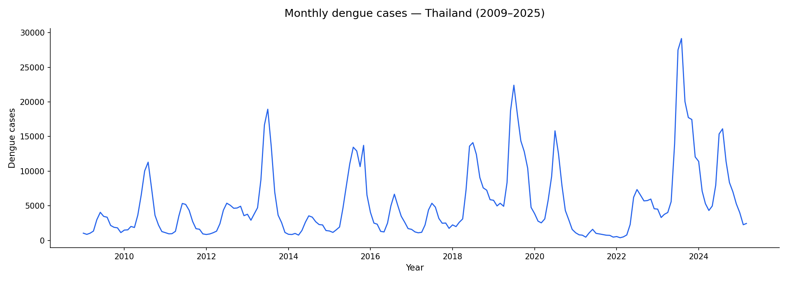
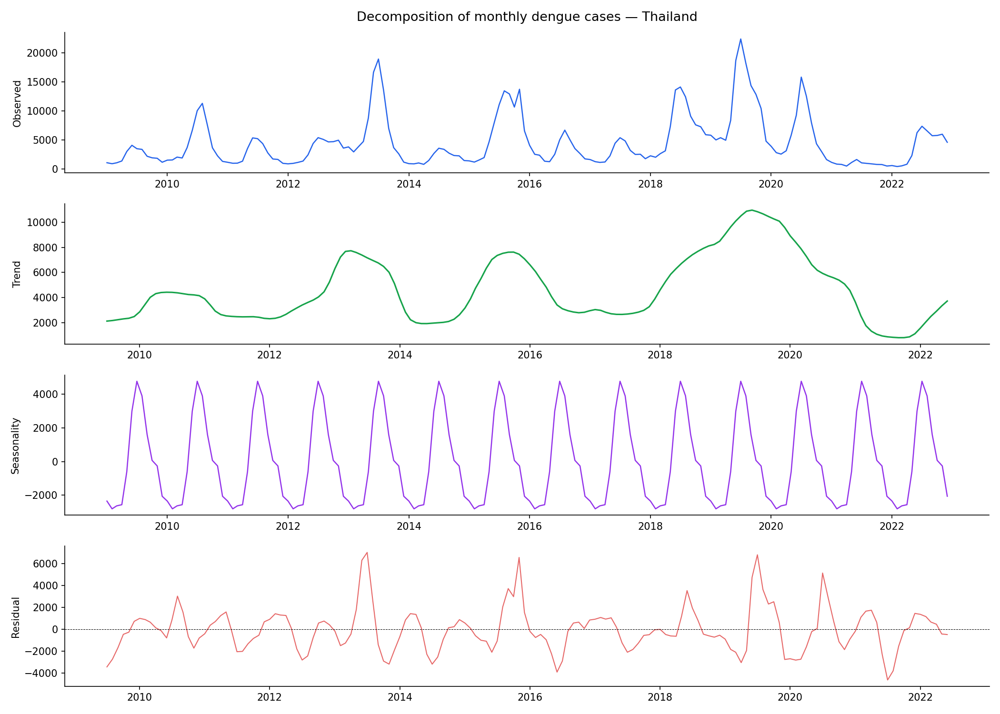
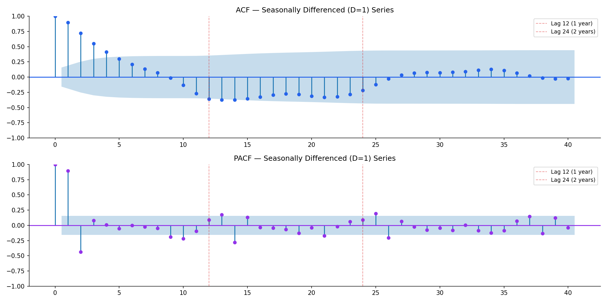

# 🇹🇭 Dengue Fever Forecasting in Thailand (2009–2025)

### Building an Early-Warning System for Disease Outbreaks Using Advanced Time Series Forecasting


---

## 📌 Project Overview
## Monthly Dengue Cases in Thailand


Dengue fever is one of the most significant mosquito-borne diseases affecting tropical regions worldwide. Unexpected outbreaks place substantial pressure on healthcare infrastructure, pharmaceutical supply chains, and public health systems.

This project develops a robust forecasting framework for predicting **monthly dengue cases in Thailand** using advanced statistical time-series methods. The objective is to generate reliable early-warning signals that can support healthcare planning and outbreak preparedness.

Unlike conventional forecasting projects that rely solely on automated model selection, this work incorporates rigorous statistical testing, seasonal unit root analysis, benchmark comparisons, and sensitivity analysis to ensure model validity and interpretability.


---

## 🎯 Business Problem

Healthcare organizations often struggle to respond effectively to sudden increases in disease incidence.

Accurate forecasting can help:

* Optimize medicine and vaccine inventory
* Improve hospital resource planning
* Support public health interventions
* Reduce response time during outbreaks
* Enable proactive healthcare decision-making

---

## 📊 Dataset

| Attribute       | Details              |
| --------------- | -------------------- |
| Source          | OpenDengue           |
| Geography       | Thailand             |
| Frequency       | Monthly              |
| Coverage        | 2009 – 2025          |
| Target Variable | Monthly Dengue Cases |

---

## 🔍 Project Workflow

### 1. Data Quality Assessment

A comprehensive data quality audit was conducted before modeling:

* Missing value analysis
* Duplicate record checks
* Temporal consistency validation
* Structural integrity verification

---

### 2. Exploratory Data Analysis

The exploratory analysis focused on:

* Long-term disease trends
* Seasonal outbreak behavior
* High-incidence years
* Distributional characteristics
* Temporal patterns in dengue transmission

---

### 3. Time Series Decomposition

The dengue series was decomposed into:

* Trend Component
* Seasonal Component
* Residual Component

This provided insight into the underlying drivers of disease incidence and confirmed strong seasonal behavior.



---

### 4. Stationarity Testing

Multiple statistical tests were applied:

#### Augmented Dickey-Fuller (ADF)

Evaluates whether the series contains a unit root.

#### KPSS Test

Evaluates whether the series is stationary around a deterministic trend.

Using both tests provides stronger evidence for differencing decisions.

---

### 5. HEGY Seasonal Unit Root Analysis

One of the key differentiators of this project is the application of **HEGY (Hylleberg–Engle–Granger–Yoo) Seasonal Unit Root Testing**.

Most forecasting projects determine seasonal differencing through heuristics or visual inspection. This project uses a formal statistical framework to evaluate seasonal integration and justify model specification decisions.

This adds a level of methodological rigor rarely seen in typical forecasting implementations.



---

### 6. Benchmark Modeling

Several baseline models were developed for comparison:

* AR(1)
* AR(2)
* MA(1)
* MA(2)

These benchmarks establish a performance baseline before moving to more sophisticated seasonal models.

---

### 7. SARIMA Model Development

Model selection was performed using:

* Auto-ARIMA search
* Information criteria (AIC)
* Residual diagnostics
* Forecast accuracy metrics
* Statistical significance testing

The final framework captures both short-term dependencies and annual seasonal cycles in dengue incidence.

---

### 8. Feature Engineering

An endogenous lag feature (`lag_1`) was introduced to evaluate whether recent disease activity improves predictive performance.

The inclusion of lag-based information significantly enhanced forecast accuracy.

---

### 9. COVID-19 Sensitivity Analysis

The COVID-19 period introduced unusual behavioral and mobility changes that affected disease transmission dynamics.

Additional sensitivity analysis was performed to evaluate model robustness under these conditions and assess the impact of data imputation strategies.

---

## 🏆 Final Model

### Best Performing Model

```text
SARIMA(0,0,1)(1,1,1,12) + lag_1
```

This model achieved the strongest balance between:

* Forecast accuracy
* Statistical validity
* Interpretability
* Robustness


---

## 📈 Key Results

### Major Findings

✅ Strong annual seasonality exists in Thailand's dengue cases.

✅ Seasonal effects explain a substantial portion of outbreak variation.

✅ Lag-based feature engineering dramatically improves predictive performance.

✅ Seasonal differencing is critical for accurate forecasting.

✅ The final model remains robust despite COVID-era disruptions.

✅ Extreme outbreak spikes remain difficult to forecast without external environmental variables.

---

## 💡 Business Impact

The developed forecasting framework can support:

### Healthcare Planning

* Hospital capacity management
* Workforce allocation
* Resource planning

### Pharmaceutical Supply Chains

* Medicine procurement
* Inventory optimization
* Distribution planning

### Public Health Agencies

* Early outbreak detection
* Risk monitoring
* Preventive intervention planning

---

## 🛠️ Technology Stack

### Programming & Analytics

* Python
* Pandas
* NumPy

### Visualization

* Matplotlib
* Seaborn

### Statistical Modeling

* Statsmodels
* pmdarima
* SciPy

### Evaluation

* Scikit-Learn

---

## 📂 Repository Structure

```text
Monthly_Dengue_Cases_forecasting_Thailand
│
├── data
│   ├── raw
│   └── processed
│
├── notebooks
│   └── dengue_analysis_clean.ipynb
│
├── Outputs
│   ├── figures
│   └── Project_PPT.pdf
│
└── README.md
```

---

## 🚀 Future Enhancements

Potential extensions include:

* Rainfall integration
* Temperature and humidity variables
* SARIMAX forecasting
* Mosquito vector surveillance data
* Ensemble forecasting models
* Real-time outbreak monitoring dashboards

---

## 👨‍💻 Author

### Vinamra Choudhary

Passionate about leveraging analytics, forecasting, and statistical modeling to solve real-world business and public health challenges.

**GitHub:** https://github.com/MrVinamra

---

### ⭐ If you found this project interesting, consider starring the repository.
